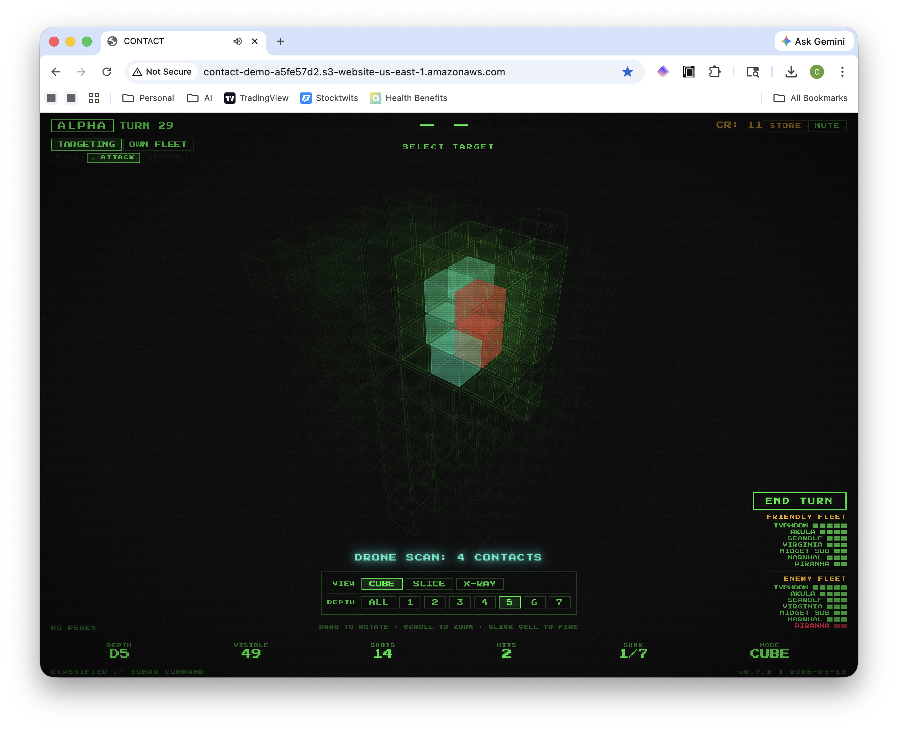

# CONTACT: 3D Naval Combat

[](https://claude.ai)
[](https://www.typescriptlang.org/)
[](LICENSE)

Browser-based 3D Battleship variant. Command submarine fleets hidden in a 7x7x7 volumetric grid, firing torpedoes and deploying earned abilities to locate and destroy enemy vessels. Play locally in hot-seat multiplayer or challenge Claude AI in Human vs AI mode. Zero server dependencies.



## Tech Stack

- **TypeScript 5.x** + **Vite 6.x**
- **Three.js** — 3D volumetric grid rendering
- **Tone.js** — Synthesized audio (no sample files)
- **Vanilla DOM** — No UI frameworks
- **Vitest** — Testing
- **Docker** — Optional local WiFi hosting

## Getting Started

```sh
npm install
npm run dev
```

## Commands

| Command | Description |
|---|---|
| `npm run dev` | Dev server with HMR on `localhost:5173` |
| `npm run build` | Production build to `dist/` |
| `npm run build:single` | Single portable HTML file (`dist/contact.html`) |
| `npm run test` | Run tests |
| `npm run simulate` | Run bot-vs-bot game simulations |
| `docker compose up -d` | Serve on port 8080 |

## Game Modes

### Local Multiplayer (Hot-Seat)

Two players share one screen, taking turns with a handoff screen between them. The default mode.

### Human vs AI

Play as ALPHA against Claude Sonnet as BRAVO. Select **VS AI** on the title screen and enter your Anthropic API key. The AI places its fleet automatically, reasons about strategy via tool use, and plays with embedded tactical knowledge from prior games. All controls are locked during the AI's turn. See [HUMAN_V_AI.md](HUMAN_V_AI.md) for full details.

## How to Play

1. **Setup** — Each player places 7 submarines + 1 decoy in the 7x7x7 grid (AI places automatically in VS AI mode)
2. **Combat** — Alternate turns: fire a torpedo, use a perk, or do both (one per slot)
3. **Victory** — Sink all 7 enemy subs to win

Each turn you have three slots available: one **ping** action, one **attack** action, and one **defend** action. Firing a torpedo always uses the attack slot. Perks consume the slot matching their type.

### Credit Economy

Credits fund the perk store. You earn them by landing shots:

| Action | Credits Earned |
|---|---|
| Hit | +1 |
| Consecutive hit (chain) | +8 |
| Sink | +15 |

Starting credits: **5**. Credits accumulate across turns within a game.

### Rank (Difficulty)

Select a rank on the title screen to control the **stalemate bonus** — a dry spell mechanic that awards bonus credits when neither player makes contact for too long. This softens the early game at lower ranks while preserving the pure experience for veterans.

| Rank | Dry Turn Threshold | Bonus Credits | Description |
|---|:---:|:---:|---|
| Recruit | 8 | +8 | Generous bonuses keep the perk economy flowing |
| Enlisted | 10 | +5 | Moderate safety net for intermediate players |
| Officer | -- | -- | No bonuses (default, original experience) |

When the threshold is reached, both players receive the bonus credits. The counter resets on any contact — torpedo hit, sonar positive, drone contact, depth charge hit, or decoy hit. The bottom bar shows a `DRY` counter for non-officer ranks.

### Fleet

| Vessel | Size |
|---|:---:|
| Typhoon | 5 |
| Akula | 4 |
| Seawolf | 3 |
| Virginia | 3 |
| Narwhal | 3 |
| Midget Sub | 2 |
| Piranha | 2 |

Ships may be placed along 8 axes — any direction except purely vertical (depth-only):

- **Within a depth slice:** `col`, `row`, `diag+`, `diag-`
- **Crossing depth layers:** `col-depth`, `col-depth-`, `row-depth`, `row-depth-`

Press **R** during placement to cycle through axes. Press **F** to flip direction.

### Perk Store

Perks are purchased with credits during combat and deployed on your turn.

| Perk | Slot | Cost | Description |
|---|---|:---:|---|
| Sonar Ping | Ping | 3 | Scans a 2x2x2 volume (up to 8 cells) for ship presence |
| Radar Jammer | Defend | 5 | Inverts the next enemy Sonar Ping result; suppresses Recon Drone |
| Recon Drone | Attack | 10 | Reveals contents of a 3x3x3 volume (up to 27 cells) |
| Silent Running | Defend | 10 | Masks one ship from recon scans for 2 opponent turns |
| Acoustic Cloak | Defend | 6 | Masks your entire fleet from recon for 2 opponent turns |
| G-SONAR | Attack | 18 | Scans a full depth layer (49 cells), reveals all ship segments |
| Depth Charge | Attack | 25 | Strikes all occupied cells in a 3x3x3 volume |

### Keyboard Shortcuts

| Key | Action |
|---|---|
| `R` | Cycle placement axis (during setup) |
| `F` | Flip placement direction (during setup) |
| `S` | Toggle between own grid and targeting grid (during combat) |

### View Modes

Switch between three 3D views during combat:

- **Cube** — Full volumetric 7x7x7 cube, orbit freely
- **Slice** — Single depth layer shown as a flat grid
- **X-Ray** — Semi-transparent cube revealing interior cells

## Session Logging

Every game session produces a structured JSONL event log covering all placements, shots, perk uses, and phase transitions. At game end, export the log from the victory screen for analysis with `jq` or any JSON Lines tool.

See [docs/JSONL_FORMAT.md](docs/JSONL_FORMAT.md) for the full event schema, payload reference, and example queries.

## Simulation

Run automated bot-vs-bot games to test game balance and perk economy:

```sh
npm run simulate                        # 100 games, officer rank (default)
npm run simulate -- 1000                # custom game count
npm run simulate -- 1 -v                # single game, verbose turn-by-turn output
npm run simulate -- 1 --export          # export JSONL session log per game
npm run simulate -- --rank recruit      # simulate with recruit rank
npm run simulate -- --rank enlisted     # simulate with enlisted rank
npm run simulate -- 500 --rank recruit  # combine options
```

Use the `--rank` flag to test the stalemate bonus mechanic at different difficulty levels:

| Rank | Dry Turn Threshold | Bonus Credits |
|---|:---:|:---:|
| Recruit | 8 | +8 |
| Enlisted | 10 | +5 |
| Officer | -- | -- |

Bots place fleets randomly across all 8 axes, buy and deploy perks with a phase-based spending strategy, and use hunt/target logic with sonar-guided targeting. Results include win rates, average game length, hit rates, credit spending, perk purchase/usage breakdowns, and stalemate bonus statistics (for non-officer ranks).

## Log Analysis

Parse any exported JSONL session log into an After Action Report:

```sh
npx tsx scripts/analyze-log.ts <path-to-log.jsonl>          # formatted report
npx tsx scripts/analyze-log.ts <path-to-log.jsonl> --json   # machine-readable JSON
```

The report includes:

- **Combat stats** — shots, hits, misses, hit rate, longest streak per player
- **Economy** — credits earned, spent, and remaining
- **Perk usage** — purchase and deployment counts per perk type, sonar hit rates, drone contacts, depth charge effectiveness
- **Ship survival** — per-ship fate (turn sunk + method) for both fleets
- **Kill order** — chronological list of every ship destroyed
- **Momentum chart** — ships sunk and credit balance tracked over time
- **Key events timeline** — sinks, depth charges, and perk deployments
- **Timing** — setup time, average turn duration per player

The analyzer handles both current and legacy log formats.

## Agent vs Agent

Run AI-powered games where two Claude instances play against each other with full strategic reasoning:

```sh
npx tsx scripts/agent-play.ts                          # default game (officer rank, memory enabled)
npx tsx scripts/agent-play.ts --verbose                # see agent reasoning and tool calls
npx tsx scripts/agent-play.ts --rank recruit           # play at recruit rank
npx tsx scripts/agent-play.ts --no-memory              # disable persistent memory
npx tsx scripts/agent-play.ts --export                 # export JSONL session log
```

Agents accumulate strategic wisdom across games via persistent memory files. After each game, both agents reflect on the match and update their memory with tactical lessons. Over multiple games, agents evolve their strategies based on experience.

Requires `ANTHROPIC_API_KEY` environment variable. See [AGENT_V_AGENT.md](AGENT_V_AGENT.md) for full documentation.

## Docs

- [Game Design Document](artifacts/design/CONTACT_GDD_v1.0.md)
- [Delivery Plan](artifacts/delivery/CONTACT_Delivery_Plan_v1.2.md)
- [Human vs AI](HUMAN_V_AI.md)
- [Agent vs Agent](AGENT_V_AGENT.md)
- [JSONL Log Format](docs/JSONL_FORMAT.md)
- [Changelog](CHANGELOG.md)

## License

[MIT](LICENSE)
